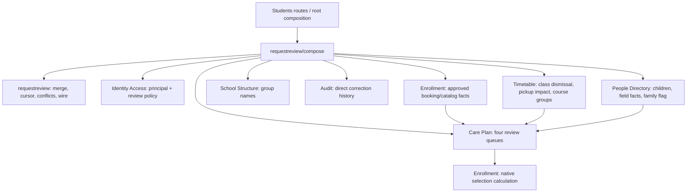

# Request-review native cutover (#3179)

## Result and scope

The staff request-review projection now binds native owner capabilities.
`modules/requestreview/legacy` and all 27 ticket import debts are gone.
The baseline is commit `8d0a410c96717ac6f01874f2540a90488963aa51`, after
#3178. The candidate is the change containing this report.

The open list, history, badge and per-type response mappers use the new
contracts. Decision workflows remain at their existing entry points.
The RSS feed remains on `parent-request-feed-read-model`. No UI, schema,
seed, golden fixture or query-budget limit changed.

## Dependency graph



Arrows describe composition and supplied facts, not arbitrary module
imports. Care Plan consumes typed ports for People Directory, Enrollment
and Timetable. SQL stays in each owner's PostgreSQL adapter. The
projection neither persists state nor imports retained service/model types.

| Responsibility | Native boundary |
|---|---|
| Child/group scope and write-queue narrowing | Identity Access request-review contract, inbound effective-permission principal |
| Latest family-protection flag without private reason | People Directory |
| Master-data live value, eligibility, conflicts | People Directory field facts + Care Plan master-data reviews |
| Weekly care diff, dismissal and pickup impact | Care Plan schedule reviews + Timetable facts |
| Offering phase dates, selections, automatic shares and course flags | Care Plan offering reviews + Enrollment selection contract |
| Absence eligibility and correction facts | Care Plan excused-request contract |
| Frozen direct-correction history | Audit correction query + Care Plan frozen diff contract |
| List/detail/preview/decision serialization | Native request-review composition mappers |

Required queue constructors fail fast. Optional group/family decorations
retain their existing optional binding and error behavior. Visibility
still follows the store cursor, so a filtered child cannot erase the
next page. One calendar day now flows through list phases, whole-queue
conflict scans, native absence eligibility and all badge counts.
Regression tests reproduce the owner's clock crossing midnight.

## Architecture and composition evidence

| Measure | Baseline | Candidate |
|---|---:|---:|
| #3179 forbidden tuples | 27 | 0 |
| All baseline violations | 1624 | 1596 |
| New baseline tuples | | 0 |
| Composition field/setter targets | 793 | 793 |
| Recorded constructor calls | 1038 | 1038 |
| Legacy caller keys / locations | 8 / 28 | 8 / 28 |
| Production / test roots | 3 / 8 | 3 / 8 |

The additional removed tuple is the now-unused internal-test
`api/students -> models/audit` edge under #2731. No debt was reassigned.
The legacy package classification and both obsolete
`request-review-view.adapter.*` rules were deleted.

The 40 added exact rules bind new owner/role points introduced here.
Comparing source and target owner/role points with the base policy found
**zero new permissions between existing points**, including external
classes. Existing package classifications are unchanged except for
deleting the legacy package. The architecture checker reports 1596
remaining violations, and the live audit confirms that 30 open migration
issues cover them. None references #3179.

`backend/architecture/composition.json` records the refreshed source
locations. The older `request-review-2705.json` checkpoint is historical
evidence, not a live package classification.

## Runtime method

The unchanged [#2705 harness](../../backend/api/students/change_request_review_runtime_test.go)
ran against the base and final candidate, separately from other tests and
lint. Both used local PostgreSQL 17.11, Go 1.27.0, concurrency one, five
warmups and 30 measured requests per scenario. Fixtures cover 0, 8 and 32
children, four pending queue types and three history rows per child.
There is no projection cache.

Artifacts preserve all 270 samples and all explained statement shapes
per run, not only averages:

- [Baseline samples](request-review-3179.baseline.jsonl)
- [Candidate samples](request-review-3179.candidate.jsonl)
- [Baseline plans](request-review-3179.baseline-plans.json)
- [Candidate plans](request-review-3179.candidate-plans.json)

Each measured request returned HTTP 200 with zero writes, unexpected
errors, pool waits, deadlocks or sampled lock waits. The runtime harness
checks list/history cardinality and successful badge responses; the
unchanged golden/parity and route tests cover full response contracts.
The runtime samples are not a separate byte-for-byte response capture.

### Measurements

Times are milliseconds, nearest-rank p50/p95. Rows are driver-reported
rows affected, not response item counts.

| Children | Request | Queries before → after | Rows before → after | Base p50 / p95 | Candidate p50 / p95 |
|---:|---|---:|---:|---:|---:|
| 0 | Open | 14 → 14 | 3 → 3 | 6.13 / 12.60 | 6.19 / 7.39 |
| 0 | History | 10 → 10 | 2 → 2 | 3.49 / 4.11 | 4.13 / 5.31 |
| 0 | Count | 8 → 8 | 1 → 1 | 2.22 / 4.12 | 2.47 / 3.04 |
| 8 | Open | 320 → 223 | 590 → 463 | 103.42 / 125.47 | 85.79 / 93.39 |
| 8 | History | 19 → 18 | 92 → 84 | 7.30 / 7.99 | 7.12 / 7.91 |
| 8 | Count | 156 → 105 | 209 → 145 | 51.58 / 66.17 | 34.64 / 40.88 |
| 32 | Open | 728 → 487 | 1550 → 1231 | 257.63 / 271.62 | 186.35 / 204.11 |
| 32 | History | 19 → 18 | 322 → 297 | 16.53 / 17.59 | 17.58 / 18.95 |
| 32 | Count | 564 → 369 | 833 → 577 | 188.38 / 214.92 | 126.55 / 145.27 |

Query counts do not regress. Small history timing increases have the same
or fewer statements and unchanged dominant plan scan counts; these local
measurements do not establish a production latency regression or guarantee.

### Query-plan comparison

The 32-child runs contain 38 open and 21 count statement shapes on both
sides; history changes from 11 to 14 shapes because native narrow reads
have distinct SQL shapes despite issuing one fewer statement.

The dominant history plans remain the searched master-data and absence
queues: respectively 48,608 scanned / 51 returned and 24,304 scanned /
32 returned on both sides. Their single-execution times change from
6.023 to 6.292 ms and 3.207 to 3.095 ms. Dominant open queue scans also
remain 24,304 / 32. Search predicates, tenant bounds and cursor limits
are preserved; this change does not optimize those existing plans.

Owner-native reads remove repeated student lookups: the plans record
215 → 52 student-table reads for open, 168 → 37 for count, and 5 → 4
for history. Weekly class-dismissal facts no longer read unrelated
date exceptions: 39 open and 32 count exception-table reads disappear.
Other removed calls came from retained service orchestration. These
reductions follow the narrow owner boundaries, not a new projection cache.

Existing per-child status, pickup, arrival and booking reads remain:
for example, open still executes 39 status-day reads and count 32.
No general N+1 rewrite is included. New course-group and family reads
require explicit ID sets; empty sets issue no SQL. Queue/count scans
retain their existing bounds and whole-queue semantics.

## Verification

Run from the worktree root with the pinned toolchain:

```sh
CGO_ENABLED=0 scripts/run-go-toolchain.sh go -C backend test ./modules/requestreview/... ./api/students
CGO_ENABLED=0 scripts/run-go-toolchain.sh go -C backend test ./api/students -run '^TestRequestReviewGolden$' -count=1
CGO_ENABLED=0 scripts/run-go-toolchain.sh go -C backend test ./api/students -run '^TestRequestReviewRuntimeEvidence$' -count=1 -v
CGO_ENABLED=0 scripts/run-go-toolchain.sh go -C backend test ./internal/architecture
scripts/run-go-toolchain.sh scripts/backend-architecture.sh check
scripts/run-go-toolchain.sh scripts/backend-architecture.sh audit-issues --api-url https://api.github.com
CGO_ENABLED=0 scripts/run-go-toolchain.sh scripts/test-changed.sh origin/development
CGO_ENABLED=0 scripts/run-go-toolchain.sh go -C backend test ./...
(cd backend && CGO_ENABLED=0 ../scripts/run-go-toolchain.sh golangci-lint run --timeout 10m)
node scripts/check-agent-context.mjs
node --test scripts/check-agent-context.test.mjs
```

All commands above passed on the final candidate. The changed-package
check covered 180 backend packages with no frontend changes. Lint reported
zero issues. Agent-context validation checked 211 documents with zero
errors; all 12 checker tests passed. `git diff --check` also passed.
The first full-suite run caught root composition complexity; extracting
native dependency binding and the group-ID resolver fixed it without an
allowlist change. The final full suite and lint passed. Two new midnight
regressions were observed failing before their fixes, then passing.

## Standards

The independent review found no hard documented-standard violation.
It raised two duplication judgment calls:

1. Enrollment's native adjustment calculation shares helper shapes with
   the retained initial-enrollment flow. The retained adjustment entry
   point now delegates to the native calculator, but initial enrollment
   remains outside this ticket's review/adjustment scope. This is a
   maintenance concern, not a demonstrated behavior defect.
2. The new course-group query duplicated the existing mapper. Both now
   call `courseGroupToPublic`.

Coverage was focused source review of the changed native boundaries,
not a line-by-line proof of the entire repository.

## Spec

The independent review found one P2 defect: list eligibility, conflict
scans and count queues could choose different dates across midnight.
The explicit shared-day flow and regression tests above resolve it.
Read-only follow-up found no remaining concrete shared-day gap in the
migrated projection. Required delivery gates are listed separately above.

Review summary: Standards, zero hard violations and one remaining
duplication judgment call; Spec, one P2 finding fixed and no remaining
actionable finding in the reviewed paths.
